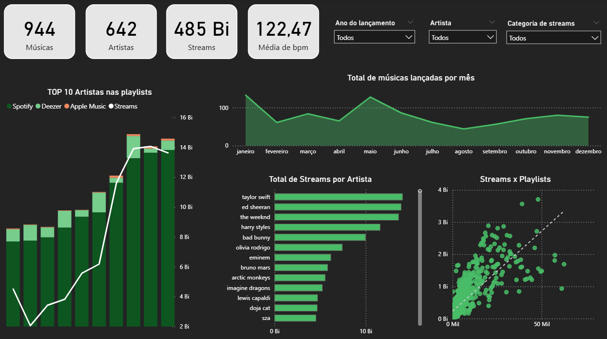

# 🎵 Validação de Hipóteses do Spotify
Esta análise, desenvolvida como parte do Bootcamp do Laboratória, investiga os fatores que influenciam o sucesso de músicas em plataformas de streaming, considerando variáveis como número de streams, presença em playlists e desempenho em diferentes plataformas.
O objetivo é gerar insights que apoiem a tomada de decisão de uma gravadora no lançamento de novos artistas.

As hipóteses levantadas pela gravadora são:
 - Músicas com BPM (batidas por minuto) mais altos fazem mais sucesso;
 - Músicas populares no ranking do Spotify apresentam comportamento semelhante em outras plataformas, como a Deezer;
 - A presença em um maior número de playlists está associada a um maior número de streams;
 - Artistas com mais músicas disponíveis no Spotify acumulam mais streams;
 - Características musicais (como energia, dançabilidade, etc.) influenciam o sucesso das faixas;

---

## Base de dados
A base de dados utilizada está disponível no arquivo [spotify_2023.zip](data/spotify_2023.zip) deste projeto.

A descrição da estrutura das tabelas e das variáveis pode ser consultada [aqui](docs/Dataset_organization.md).

---

## Ferramentas e habilidades
- SQL;
- BigQuery;
- PowerBI;
- Python;
- Pensamento analítico;

---

## Conclusões principais

## Fatores de Performance
- A presença de uma música em playlists apresenta forte correlação positiva com o número de streams.
- Isso indica que a inclusão em playlists é um dos principais impulsionadores de visibilidade e sucesso.

---

## Performance entre Plataformas
- Músicas com bom desempenho no ranking do Spotify tendem a apresentar comportamento semelhante no Deezer.
- Isso sugere consistência de popularidade entre diferentes plataformas.

---

## Estratégia de Artistas
- Existe uma correlação positiva forte entre o número de músicas de um artista e o total de streams.
- Isso indica que artistas com maior volume de lançamentos tendem a alcançar maior visibilidade.

---

## Características Musicais
- Variáveis como BPM, energia, dançabilidade e valência apresentam correlação muito fraca ou inexistente com o número de streams.
- Isso sugere que aspectos técnicos da música, isoladamente, não determinam seu sucesso.

---

## Impacto das Playlists
- A presença em playlists (Spotify, Deezer e Apple Music) tem forte influência sobre o número de streams.
- Isso reforça a importância da estratégia de distribuição e curadoria nas plataformas.

---

## Resumo das Hipóteses
- BPM vs Streams → ❌ Sem correlação  
- Popularidade entre plataformas → ✅ Correlação moderada  
- Playlists vs Streams → ✅ Correlação forte  
- Volume de músicas vs Streams → ✅ Correlação forte  
- Características musicais vs Streams → ❌ Sem correlação  

---

## Recomendações
- Priorizar estratégias de inclusão em playlists para aumentar a visibilidade das músicas;
- Investir em presença multiplataforma para ampliar o alcance dos lançamentos;
- Incentivar artistas a expandirem seu catálogo de músicas;
- Focar em estratégias de distribuição e marketing, além das características técnicas das músicas;
- Explorar segmentações por público e gênero musical para aprofundar a análise.

---

## Links importantes
Para conclusão do projeto os dados foram apresentados na seguinte [apresentação](docs/Apresentacao.pdf);

O vídeo de entrega com a apresentação do projeto, pode ser acessado [aqui](https://www.loom.com/share/3b6d4ddd7b574d589f96742a2dc28b68);

Dashboard:

